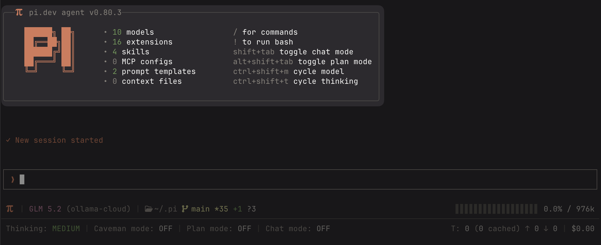
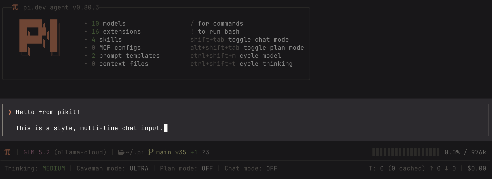
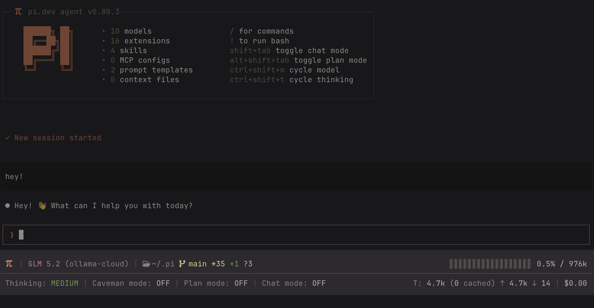

<h3 align="center">pikit — an opinionated <a href="https://pi.dev/">pi.dev</a> configuration. Batteries included.</h3>

<p align="center">
  <a href="#whats-in-here">What's in here</a> &nbsp;·&nbsp;
  <a href="#install">Install</a> &nbsp;·&nbsp;
  <a href="#extensions">Extensions</a> &nbsp;·&nbsp;
  <a href="#skills">Skills</a> &nbsp;·&nbsp;
  <a href="#prompt-templates">Prompt templates</a> &nbsp;·&nbsp;
  <a href="#theme">Theme</a> &nbsp;·&nbsp;
  <a href="#setup">Setup</a> &nbsp;·&nbsp;
  <a href="#about-pidev">About pi.dev</a>
</p>

---

## What's in here

```
agent/
├── configs/
│   ├── caveman.json             # Caveman default level — gitignored, auto-created on first use
│   ├── chat-mode.json           # Chat mode settings (tracked)
│   ├── plan-mode.json           # Plan mode settings (tracked)
│   ├── footer.json              # Footer segment configuration — gitignored, see footer/footer.example.json
│   ├── mcp.json                 # MCP server config — gitignored, see mcp/mcp.example.json
│   ├── permission-gate.json     # Permission gate patterns — gitignored, see permission-gate.example.json
│   ├── protected-paths.json     # Protected path entries — gitignored, see protected-paths.example.json
│   └── .env                     # Secret env vars — gitignored, see env-loader/.env.example
├── APPEND_SYSTEM.md             # Coding guidelines appended to the system prompt every session
├── settings.example.json        # Opinionated pi settings — copy to settings.json (gitignored)
├── skills/
│   ├── pi-extension-builder/    # Guidelines for building and modifying extensions in this repo
│   ├── add-ollama-cloud-model/  # Guidelines for adding an Ollama Cloud model to models.json
│   ├── gh/                      # Read-only GitHub CLI access via enforced wrapper
│   └── pr-review/               # Review a GitHub PR and emit findings as a markdown artifact
├── prompts/
│   ├── handoff.md               # /handoff — write a session handoff document to .pi/handoffs/
│   └── pickup.md                # /pickup — resume work from the latest handoff document
├── themes/
│   └── slop.json                # Custom warm color theme — also published as pikit-theme-slop
└── extensions/
    ├── chat-input/              # Unicode box border around the main chat input editor
    ├── caveman/                 # Compresses LLM responses: lite (professional) / full (caveman) / ultra (max compression)
    ├── env-loader/              # Injects .env tokens into process.env at startup
    ├── footer/                  # Status bar with git, tokens, cost, context
    ├── mcp/                     # MCP server bridge with lazy connections and proxy tool
    ├── plan-mode/               # Plan-then-execute workflow: read-only planning, then execute with plan_complete
    ├── chat-mode/               # Read-only conversational mode: chat, explore, search — no edits
    ├── permission-gate/         # Confirms dangerous bash commands before running
    ├── protected-paths/         # Blocks read/write access to sensitive files and directories
    ├── llm-council/             # Multi-model council: members answer independently, chairman synthesises
    ├── spinners/                # Rotating spinner verbs while the agent thinks
    ├── startup/                 # Welcome header shown at session start
    ├── styled-outputs/          # Custom styled rendering for all message types (tools, diffs, thinking, skills)
    ├── subagents/               # Delegate tasks to specialized child agents (single, parallel, chain)
    ├── web-access/              # Web search, page fetching, and PDF extraction
    └── artifacts/               # Visual HTML artifacts (markdown/html) on a lazy localhost server with live reload
```

---

## Install

Three ways in, depending on how much of the kit you want:

### 1. The full setup (recommended)

Clone this repo as your `~/.pi/` directory — settings, system prompt additions, keybindings, configs, everything. Walkthrough in [Setup](#setup).

```bash
git clone https://github.com/adrianapan/pikit.git ~/.pi
cd ~/.pi && npm install
```

### 2. Already using pi? Layer it on top

Keep your existing `~/.pi` exactly as it is and install this repo as a single [pi package](https://github.com/earendil-works/pi/blob/main/packages/coding-agent/docs/packages.md) — all 16 extensions, 4 skills, the prompt templates, and the slop theme load alongside your current setup:

```bash
pi install git:github.com/adrianapan/pikit
```

Settings, keybindings, and the `APPEND_SYSTEM.md` prompt additions don't travel with the package — pi reads those only from `~/.pi/agent/`. Toggle individual extensions on or off with `pi config`.

### 3. Individual extensions

Every extension (and the theme) is published standalone on npm with the `pikit-` prefix:

```bash
pi install npm:pikit-footer
pi install npm:pikit-caveman
pi install npm:pikit-theme-slop
# ... any of the extensions listed below
```

Package name = `pikit-` + the directory name in the [Extensions](#extensions) list. Browse them all in the [pi package gallery](https://pi.dev/packages).

---

## Extensions

### startup

Renders a welcome box at session start with the pi logo, keyboard hints, and counts of loaded extensions, skills, MCP configs, and context files. Zero config. → [`README`](agent/extensions/startup/README.md)



### chat-input

Replaces the default chat input with a configurable, boxed input. All native editor features — cursor movement, history, autocomplete, paste — work normally inside the box. → [`README`](agent/extensions/chat-input/README.md)



### footer

Replaces pi's default status bar with a configurable strip showing model, thinking level, current path, git branch, token counts, and estimated cost. Segments are defined in `footer.json`; Nerd Font icons with plain-ASCII fallbacks. → [`README`](agent/extensions/footer/README.md)



### permission-gate

Intercepts bash tool calls and prompts for confirmation before running commands that match dangerous patterns (`rm -rf`, `sudo`, `chmod 777`). Blocks silently in headless mode. Patterns are fully configurable via `permission-gate.json`. → [`README`](agent/extensions/permission-gate/README.md)

https://github.com/user-attachments/assets/cef479b8-6d1c-4c57-89f5-175009e9b856

### protected-paths

Blocks read, write, and edit calls to sensitive files and directories. Each entry defines a path and an explicit deny list, so you can block writes while still allowing reads. Ships with four built-in entries (`.env`, `.git/`, `node_modules/`, `auth.json`); fully configurable via `protected-paths.json`. → [`README`](agent/extensions/protected-paths/README.md)

https://github.com/user-attachments/assets/4e41c2f5-0702-404c-97ae-487ce52970dc

### env-loader

Loads `~/.pi/agent/configs/.env` into `process.env` at startup, keeping API tokens out of your shell profile. Shell environment always wins — existing vars are never overwritten. Check what was loaded (without exposing values) via `/env`. → [`README`](agent/extensions/env-loader/README.md)

### mcp

Bridges MCP servers into pi via a single proxy tool instead of loading all tool schemas at startup. The LLM searches and calls tools on demand; servers start lazily and metadata is cached to disk. Supports stdio and HTTP transports with automatic OAuth browser-open for protected servers. Configured via `mcp.json`; use `/mcp` to check status, list tools, and manage connections. → [`README`](agent/extensions/mcp/README.md)

### web-access

Gives the agent web search and page fetching. `web_search` uses Gemini AI for a synthesized answer with source citations; `fetch_content` extracts clean markdown from any URL or PDF. Search requires `GEMINI_API_KEY`; fetching works without a key. → [`README`](agent/extensions/web-access/README.md)

### caveman

Compresses pi's responses from polished prose to prehistoric grunt. Three modes — `lite` (professional, no filler), `full` (classic caveman), `ultra` (maximum compression) — injected into the system prompt. Toggled via `/caveman`; active mode shows in the footer. → [`README`](agent/extensions/caveman/README.md)

### plan-mode

Toggle plan mode via `/plan` or via the shortcut. PLAN restricts tools to read-only and prompts the LLM to produce a numbered action plan; EXECUTE restores all tools and injects the full plan into the system prompt each turn; the LLM calls `plan_complete()` when done. → [`README`](agent/extensions/plan-mode/README.md)

https://github.com/user-attachments/assets/eb70370e-3f75-4c22-a0eb-901bf91bae00

### chat-mode

Toggle chat mode via `/chat` or `ctrl+shift+c`. Restricts tools to read-only and prompts the LLM to converse — answer questions, discuss, explore code, search the web — without making any changes. Bash gate blocks destructive commands. Mutually exclusive with plan-mode. `--chat` flag starts in chat mode. → [`README`](agent/extensions/chat-mode/README.md)

https://github.com/user-attachments/assets/fc337d4c-bd23-4d28-80e2-01253f7bc89e

### spinners

Replaces the default **Thinking** verb with Claude-style random alternatives from a curated list, cycling periodically with a typewriter reveal. Shows elapsed time and estimated token count as the turn progresses. Icon and colors are fully customisable via `spinners.json`. → [`README`](agent/extensions/spinners/README.md)

### llm-council

Convene an LLM Council — multiple models answer a question independently in parallel, then a chairman synthesises their answers into a unified response. Useful when accuracy matters or perspectives diverge. Members get read-only tool access; the chairman only synthesises. Configurable council roster, system prompts, thinking levels, and display options via `llm-council.json`. → [`README`](agent/extensions/llm-council/README.md)

https://github.com/user-attachments/assets/031066b9-c47e-4ece-9491-a648d2cc545f

### styled-outputs

Custom styled rendering for every message type in pi — assistant messages, user messages, thinking blocks, tool executions, skill invocations, MCP tools, and bash commands. Replaces flat output with prefix icons, colour-coded diffs, expandable sections, and grouped tool configs. All colours accept pi theme tokens or hex values. → [`README`](agent/extensions/styled-outputs/README.md)

https://github.com/user-attachments/assets/6bcf414f-9114-405e-af9e-392a8f4e8bdc

### subagents

Delegate tasks to specialized child pi processes that work independently with their own model, tools, extensions, and skills. Supports single (one agent, one task), parallel (up to 8 tasks, 4 concurrent), and chain (sequential steps with `{previous}` piping) modes. Child agents are defined as `.md` files with YAML frontmatter in `~/.pi/agent/agents/` or `.pi/agents/`. → [`README`](agent/extensions/subagents/README.md)

### artifacts

Gives the agent a visual output surface: an `artifact` tool that renders markdown or HTML to a styled page served from a lazy localhost server and opened in the browser. Markdown handles `diff` fences (server-side diff2html), code fences (server-side highlight.js), and `mermaid` fences (client-side) automatically; `update` live-reloads an already-open tab. Storage at `.pi/artifacts/<slug>.html`. Use `/artifacts` to open the index page and browse what's been generated. → [`README`](agent/extensions/artifacts/README.md)

https://github.com/user-attachments/assets/b84e0ebd-84db-45ec-ba77-52aede167b4e

---

## Skills

### pi-extension-builder

Loaded when you ask pi to build or modify an extension in this repo. Covers file structure, code conventions, and documentation requirements. Invoke explicitly with `/skill:pi-extension-builder`.

### add-ollama-cloud-model

Loaded when you ask pi to add an Ollama Cloud model. Fetches the model page, extracts capabilities, and writes the correct entry to `models.json`. Invoke explicitly with `/skill:add-ollama-cloud-model`.

### gh

Read-only GitHub CLI access via an enforced wrapper. Lists issues, PRs, repos, runs, releases, and more — but blocks all write, delete, and modify commands. Load when working with GitHub resources. Invoke explicitly with `/skill:gh`.

### pr-review

Review a GitHub PR and emit the findings as a markdown artifact (rendered HTML report in the browser). Gathers the diff via the `gh` skill, reviews it, then produces one `artifact` — verdict up top, findings ranked by severity, per-file `diff` fences. Invoke explicitly with `/skill:pr-review`.

---

## Prompt templates

### handoff

`/handoff [filename]` — generates a comprehensive handoff document (summary, work completed, files affected, current state, next steps) and saves it to the project's `.pi/handoffs/` directory (same convention as plan-mode's `.pi/plans/`). Use it when a session's context is getting full or you want to continue in a fresh session without carrying the full conversation over.

### pickup

`/pickup [filename]` — the companion to `/handoff`. Reads the most recent handoff document from `.pi/handoffs/` (or a specific one by name), verifies it against the current git state, summarises where things stand, and starts on the "Immediate Next Steps" section.

> Note: for simply continuing a previous conversation as-is, pi's native sessions already cover it (`pi -c`, `/resume`). The handoff/pickup pair is for starting *fresh* with distilled context.

---

## Theme

### slop

A warm, earthy palette with terracotta primary (`#d67858`) and warm-white text (`#f5f2ee`), covering all 51 pi color tokens including syntax highlighting and thinking level indicators. Activate via `/settings → Theme → slop`.

---

## System prompt

Pi appends [`agent/APPEND_SYSTEM.md`](agent/APPEND_SYSTEM.md) to its default system prompt on every session — no extension code involved. This repo ships a trimmed version of [Andrej Karpathy's coding guidelines](https://github.com/forrestchang/andrej-karpathy-skills/blob/main/CLAUDE.md) — think before coding, simplicity first, surgical changes, goal-driven execution — plus a fifth nudge to emit visual output via the `artifact` tool.

---

## Setup

> [!TIP]
> Best experienced with [Ghostty](https://ghostty.org/) — fast, GPU-accelerated, and Nerd Font icons work out of the box.

Four commands, then log in:

```bash
npm install -g @earendil-works/pi-coding-agent            # install pi (Node 22.19+)
git clone https://github.com/adrianapan/pikit.git ~/.pi   # this repo becomes your pi config
cd ~/.pi && npm install                                   # one install covers all extensions
cp agent/settings.example.json agent/settings.json        # opinionated defaults (slop theme etc.)
```

### Authenticate

Launch `pi`, then either:

- **Subscription** — run `/login` and pick your provider (Claude Pro/Max, ChatGPT Plus/Pro, GitHub Copilot, Google Gemini). Tokens are stored in `agent/auth.json` and auto-refresh.
- **API key** — export it before launching: `ANTHROPIC_API_KEY`, `OPENAI_API_KEY`, `GEMINI_API_KEY`, `OPENROUTER_API_KEY`, `GROQ_API_KEY`, … Full list in the [providers docs](https://github.com/earendil-works/pi/blob/main/packages/coding-agent/docs/providers.md).

That's the whole setup. Everything below is optional.

<details>
<summary><strong>Already using pi? Keep your auth, sessions, and models</strong></summary>
<br>

Your existing `~/.pi/` holds auth tokens, session history, and custom models. Move it aside, clone, then carry those over so you don't have to log in again:

```bash
mv ~/.pi ~/.pi.bak
git clone https://github.com/adrianapan/pikit.git ~/.pi
cd ~/.pi && npm install
cp ~/.pi.bak/agent/auth.json ~/.pi/agent/
cp ~/.pi.bak/agent/models.json ~/.pi/agent/
cp -R ~/.pi.bak/agent/sessions ~/.pi/agent/
```

Prefer to keep your own config as the base? Layer the kit on top instead — `pi install git:github.com/adrianapan/pikit` (see [Install](#install)).

</details>

<details>
<summary><strong>Nerd Fonts — icons in the footer and startup header</strong></summary>
<br>

Install one and most terminals (Ghostty, WezTerm, Kitty, Alacritty) pick it up automatically:

```bash
brew install --cask font-jetbrains-mono-nerd-font   # or: brew search nerd-font
```

iTerm2 needs one extra step: **Settings → Profiles → Text** → set the font, and enable **Use a different font for non-ASCII text** with the same font. Icons still wrong? Force them with `export FOOTER_NERD_FONTS=1`. Without a Nerd Font everything falls back to plain ASCII.

</details>

<details>
<summary><strong>Extension configs — permission gate, protected paths, MCP, footer, secrets</strong></summary>
<br>

Every extension runs with sane defaults. To customise one, copy its example config into `agent/configs/` and edit — each extension's README documents the options:

```bash
cd ~/.pi/agent
cp extensions/permission-gate/permission-gate.example.json configs/permission-gate.json
cp extensions/protected-paths/protected-paths.example.json configs/protected-paths.json
cp extensions/mcp/mcp.example.json configs/mcp.json
cp extensions/footer/footer.example.json configs/footer.json
cp extensions/env-loader/.env.example configs/.env    # API tokens, gitignored — verify with /env
```

</details>

### Custom or local models

`agent/models.json` (gitignored, hot-reloads while pi runs) registers local models or any OpenAI-compatible endpoint — full reference in the [models docs](https://github.com/earendil-works/pi/blob/main/packages/coding-agent/docs/models.md).

#### Ollama — local models

Point `baseUrl` at the Ollama daemon and list whichever models you have pulled. `apiKey` is required but ignored locally.

```json
{
  "providers": {
    "ollama": {
      "api": "openai-completions",
      "apiKey": "ollama",
      "baseUrl": "http://127.0.0.1:11434/v1",
      "models": [
        {
          "id": "qwen3.5:4b",
          "name": "Qwen3.5 4B",
          "contextWindow": 265000,
          "input": ["text", "image"],
          "reasoning": true
        }
      ]
    }
  }
}
```

#### Ollama — cloud models

Ollama Cloud needs an API key and a `compat` block — cloud models don't support the `developer` role pi uses for reasoning models. Store the key in `agent/configs/.env`, then read it with the shell-command form so it's resolved at runtime:

```json
{
  "providers": {
    "ollama-cloud": {
      "api": "openai-completions",
      "apiKey": "!grep ^OLLAMA_API_KEY ~/.pi/agent/configs/.env | cut -d= -f2",
      "baseUrl": "https://ollama.com/v1",
      "compat": {
        "supportsDeveloperRole": false
      },
      "models": [
        {
          "id": "qwen3.5:cloud",
          "name": "Qwen 3.5",
          "contextWindow": 265000,
          "input": ["text", "image"],
          "reasoning": true
        }
      ]
    }
  }
}
```

Browse models at [ollama.com/search](https://ollama.com/search) — cloud variants use the `:cloud` suffix. Or skip the JSON and just ask pi — *"Add https://ollama.com/library/qwen3.5 to my Ollama cloud config"* — and the [`add-ollama-cloud-model`](agent/skills/add-ollama-cloud-model/SKILL.md) skill handles it.

---

## About pi.dev

[Pi](https://pi.dev/) is a minimal, extensible terminal coding agent. Its philosophy is a small core with maximal extensibility — features other agents ship built-in (plan mode, permission gates, sub-agents, even MCP support) are deliberately left to the community to build as extensions and packages. This kit is one opinionated take on that community layer: everything in it is ordinary pi extension, skill, prompt, and theme code.

One design choice worth knowing up front: **pi has no built-in MCP support**. The [`mcp` extension](agent/extensions/mcp/README.md) in this kit provides a full bridge.

For concepts and APIs, [pi's own docs](https://github.com/earendil-works/pi/tree/main/packages/coding-agent/docs) are the source of truth — linked here so this README doesn't have to keep up with them:

- [Quickstart](https://github.com/earendil-works/pi/blob/main/packages/coding-agent/docs/quickstart.md) — install, auth, first session
- [Extensions](https://github.com/earendil-works/pi/blob/main/packages/coding-agent/docs/extensions.md) — the `ExtensionAPI` everything in `agent/extensions/` is built on
- [Skills](https://github.com/earendil-works/pi/blob/main/packages/coding-agent/docs/skills.md) and [Prompt templates](https://github.com/earendil-works/pi/blob/main/packages/coding-agent/docs/prompt-templates.md)
- [Themes](https://github.com/earendil-works/pi/blob/main/packages/coding-agent/docs/themes.md)
- [Packages](https://github.com/earendil-works/pi/blob/main/packages/coding-agent/docs/packages.md) — how `pi install` and the [package gallery](https://pi.dev/packages) work
- [Models](https://github.com/earendil-works/pi/blob/main/packages/coding-agent/docs/models.md) and [Providers](https://github.com/earendil-works/pi/blob/main/packages/coding-agent/docs/providers.md)
- [Settings](https://github.com/earendil-works/pi/blob/main/packages/coding-agent/docs/settings.md) and [Keybindings](https://github.com/earendil-works/pi/blob/main/packages/coding-agent/docs/keybindings.md)

> **Security note:** pi extensions run with full system access — that applies to this kit and anything else you install. Review the source before trusting a package; everything here is small enough to read in one sitting.
