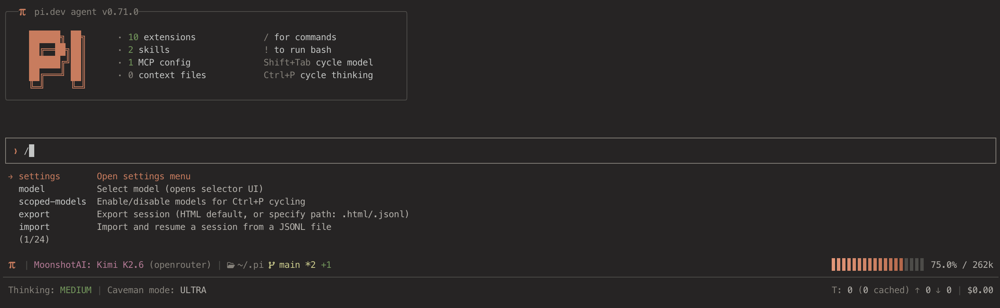

An opinionated [pi.dev](https://pi.dev/) configuration. Batteries included.

<p align="center">
  <a href="#whats-in-here">What's in here</a> &nbsp;·&nbsp;
  <a href="#extensions">Extensions</a> &nbsp;·&nbsp;
  <a href="#skills">Skills</a> &nbsp;·&nbsp;
  <a href="#theme">Theme</a> &nbsp;·&nbsp;
  <a href="#first-run-setup">First-run setup</a> &nbsp;·&nbsp;
  <a href="#about-pidev">About pi.dev</a>
</p>

---

## What's in here

```
agent/
├── configs/
│   ├── caveman.json             # Caveman default level — gitignored, auto-created on first use
│   ├── footer.json              # Footer segment configuration (tracked)
│   ├── mcp.json                 # MCP server config — gitignored, see mcp/mcp.json.example
│   ├── permission-gate.json     # Permission gate patterns — gitignored, see permission-gate.example.json
│   ├── protected-paths.json     # Protected path entries — gitignored, see protected-paths.example.json
│   └── .env                     # Secret env vars — gitignored, see env-loader/.env.example
├── APPEND_SYSTEM.md             # Coding guidelines appended to the system prompt every session
├── skills/
│   ├── pi-extension-builder/    # Guidelines for building and modifying extensions in this repo
│   └── add-ollama-cloud-model/  # Guidelines for adding an Ollama Cloud model to models.json
├── themes/
│   └── slop.json     # Custom warm color theme
└── extensions/
    ├── caveman/      # Compresses LLM responses: lite (professional) / full (caveman) / ultra (max compression)
    ├── env-loader/   # Injects .env tokens into process.env at startup
    ├── footer/       # Status bar with git, tokens, cost, context
    ├── mcp/          # MCP server bridge with lazy connections and proxy tool
    ├── permission-gate/ # Confirms dangerous bash commands before running
    ├── protected-paths/ # Blocks read/write access to sensitive files and directories
    ├── spinners/     # Rotating spinner verbs while the agent thinks
    ├── startup/      # Welcome header shown at session start
    └── web-access/   # Web search, page fetching, and PDF extraction
```

---

## Extensions

### caveman

Compresses pi's responses from polished prose to prehistoric grunt. Three modes — `lite` (professional, no filler), `full` (classic caveman), `ultra` (maximum compression) — injected into the system prompt. Toggled via `/caveman`; active mode shows in the footer. → [`README`](agent/extensions/caveman/README.md)

### env-loader

Loads `~/.pi/agent/configs/.env` into `process.env` at startup, keeping API tokens out of your shell profile. Shell environment always wins — existing vars are never overwritten. Check what was loaded (without exposing values) via `/env`. → [`README`](agent/extensions/env-loader/README.md)

### footer

Replaces pi's default status bar with a configurable strip showing model, thinking level, current path, git branch, token counts, and estimated cost. Segments are defined in `footer.json`; Nerd Font icons with plain-ASCII fallbacks. → [`README`](agent/extensions/footer/README.md)

### mcp

Bridges MCP servers into pi via a single proxy tool instead of loading all tool schemas at startup. The LLM searches and calls tools on demand; servers start lazily and metadata is cached to disk. Supports stdio and HTTP transports with automatic OAuth browser-open for protected servers. Configured via `mcp.json`; use `/mcp` to check status, list tools, and manage connections. → [`README`](agent/extensions/mcp/README.md)

### permission-gate

Intercepts bash tool calls and prompts for confirmation before running commands that match dangerous patterns (`rm -rf`, `sudo`, `chmod 777`). Blocks silently in headless mode. Patterns are fully configurable via `permission-gate.json`. → [`README`](agent/extensions/permission-gate/README.md)

### protected-paths

Blocks read, write, and edit calls to sensitive files and directories. Each entry defines a path and an explicit deny list, so you can block writes while still allowing reads. Ships with four built-in entries (`.env`, `.git/`, `node_modules/`, `auth.json`); fully configurable via `protected-paths.json`. → [`README`](agent/extensions/protected-paths/README.md)

### spinners

Replaces "Thinking..." with 186 rotating verbs, cycling every 2.5 seconds with a typewriter reveal. Zero config. → [`README`](agent/extensions/spinners/README.md)

### startup

Renders a welcome box at session start with the pi logo, keyboard hints, and counts of loaded extensions, skills, MCP configs, and context files. Zero config. → [`README`](agent/extensions/startup/README.md)

### web-access

Gives the agent web search and page fetching. `web_search` uses Gemini AI for a synthesized answer with source citations; `fetch_content` extracts clean markdown from any URL or PDF. Search requires `GEMINI_API_KEY`; fetching works without a key. → [`README`](agent/extensions/web-access/README.md)

---

## Skills

- **`pi-extension-builder`** — loaded when you ask pi to build or modify an extension in this repo. Covers file structure, code conventions, and documentation requirements. Invoke explicitly with `/skill:pi-extension-builder`.
- **`add-ollama-cloud-model`** — loaded when you ask pi to add an Ollama Cloud model. Fetches the model page, extracts capabilities, and writes the correct entry to `models.json`. Invoke explicitly with `/skill:add-ollama-cloud-model`.

---

## Theme

**slop** — a warm, earthy palette with terracotta primary (`#d67858`) and warm-white text (`#f5f2ee`), covering all 51 pi color tokens including syntax highlighting and thinking level indicators. Activate via `/settings → Theme → slop`.

---

## First-run setup

### 1. Install pi

```bash
npm install -g @mariozechner/pi-coding-agent
```

Requires Node.js 18+. On macOS, the easiest way to get Node is via [nvm](https://github.com/nvm-sh/nvm) or [Homebrew](https://brew.sh).

### 2. Clone this repo

Pi looks for its config in `~/.pi/`. Clone this repo directly into that directory:

```bash
git clone git@github.com:adrianapan/pi-dev.git ~/.pi
# or via HTTPS
git clone https://github.com/adrianapan/pi-dev.git ~/.pi
```

> If `~/.pi/` already exists from a previous pi install, back it up first: `mv ~/.pi ~/.pi.bak`

### 3. Install extension dependencies

This repo uses npm workspaces. A single install at the root handles all extension dependencies:

```bash
cd ~/.pi
npm install
```

### 4. Authenticate

Launch pi:

```bash
pi
```

**Via subscription** (Claude Pro/Max, ChatGPT Plus/Pro, GitHub Copilot, Google Gemini) — run inside pi:

```
/login
```

Select your provider and complete the OAuth flow in the browser. Tokens are stored in `~/.pi/agent/auth.json` and auto-refresh when expired.

**Via API key** — set the environment variable before launching:

```bash
export ANTHROPIC_API_KEY=sk-ant-...
pi
```

| Provider | Environment variable |
|----------|---------------------|
| Anthropic | `ANTHROPIC_API_KEY` |
| OpenAI | `OPENAI_API_KEY` |
| Google Gemini | `GEMINI_API_KEY` |
| OpenRouter | `OPENROUTER_API_KEY` |
| Groq | `GROQ_API_KEY` |

See the full provider list in the [pi providers docs](https://github.com/badlogic/pi-mono/blob/main/packages/coding-agent/docs/providers.md).

### 5. Enable the slop theme

Open `/settings` inside pi, navigate to **Theme**, and select `slop`.

### 6. Set up Nerd Fonts (recommended)

The footer and startup extensions use Nerd Font icons for git status, model info, and other indicators. Most modern terminals (Ghostty, WezTerm, Kitty, Alacritty) auto-detect support — iTerm2 needs a small one-time config.

**Install a Nerd Font on macOS:**

```bash
brew install --cask font-jetbrains-mono-nerd-font
```

Other fonts available via `brew search nerd-font`.

**Configure iTerm2:**

1. Open **Settings → Profiles → Text**
2. Set **Font** to `JetBrainsMonoNL Nerd Font Propo`, size `12`
3. Enable **Use a different font for non-ASCII text** and set the same font there — required for icons to render correctly

No config needed for Ghostty, WezTerm, Kitty, or Alacritty — icons work out of the box. If icons still look wrong, force Nerd Font mode:

```bash
export FOOTER_NERD_FONTS=1
```

### 7. Configure protected paths (optional)

The `protected-paths` extension ships with four built-in entries (`.env`, `.git/`, `node_modules/`, `~/.pi/agent/auth.json`). To customise them, copy the example config:

```bash
cp ~/.pi/agent/extensions/protected-paths/protected-paths.example.json \
   ~/.pi/agent/configs/protected-paths.json
```

See [`agent/extensions/protected-paths/README.md`](agent/extensions/protected-paths/README.md) for the full reference.

### 8. Configure permission patterns (optional)

The `permission-gate` extension ships with three built-in patterns. To customise them, copy the example config:

```bash
cp ~/.pi/agent/extensions/permission-gate/permission-gate.example.json \
   ~/.pi/agent/configs/permission-gate.json
```

See [`agent/extensions/permission-gate/README.md`](agent/extensions/permission-gate/README.md) for the full reference.

### 9. Configure MCP servers (optional)

Copy the example config and edit it with your servers:

```bash
cp ~/.pi/agent/extensions/mcp/mcp.json.example ~/.pi/agent/configs/mcp.json
```

See [`agent/extensions/mcp/README.md`](agent/extensions/mcp/README.md) for the full configuration reference.

### 10. Set up environment variables (optional)

If any extensions require API tokens (MCP servers, web-access search, etc.), store them in `~/.pi/agent/configs/.env` (gitignored) rather than your shell profile:

```bash
cp ~/.pi/agent/extensions/env-loader/.env.example ~/.pi/agent/configs/.env
```

Edit the file with your actual values. Use `/env` inside pi to verify what was loaded.

See [`agent/extensions/env-loader/README.md`](agent/extensions/env-loader/README.md) for details.

### 11. Add custom or local models (optional)

`agent/models.json` is excluded from this repo. Create it to register local models (Ollama, LM Studio, vLLM) or any OpenAI-compatible endpoint.

The file hot-reloads — edit it while pi is running and open `/model` to pick up changes. See the [custom models docs](https://github.com/badlogic/pi-mono/blob/main/packages/coding-agent/docs/models.md) for the full reference.

#### Ollama — local models

Point `baseUrl` at the Ollama daemon and list whichever models you have pulled. Use `apiKey: "ollama"` — the value is required but ignored locally.

```json
{
  "providers": {
    "ollama": {
      "api": "openai-completions",
      "apiKey": "ollama",
      "baseUrl": "http://127.0.0.1:11434/v1",
      "models": [
        {
          "id": "qwen3.5:4b",
          "name": "Qwen3.5 4B",
          "contextWindow": 262144,
          "input": ["text", "image"],
          "reasoning": true
        }
      ]
    }
  }
}
```

#### Ollama — cloud models

Ollama Cloud requires an API key and a `compat` block — cloud models don't support the `developer` role pi uses for reasoning models.

Store your key in `~/.pi/agent/configs/.env` (managed by the `env-loader` extension):

```
OLLAMA_API_KEY=your-key-here
```

Then reference it in `models.json` using the shell command form so it's read from the file at runtime rather than the shell environment:

```json
{
  "providers": {
    "ollama-cloud": {
      "api": "openai-completions",
      "apiKey": "!grep ^OLLAMA_API_KEY ~/.pi/agent/configs/.env | cut -d= -f2",
      "baseUrl": "https://ollama.com/v1",
      "compat": {
        "supportsDeveloperRole": false
      },
      "models": [
        {
          "id": "qwen3.5:cloud",
          "name": "Qwen 3.5",
          "contextWindow": 262144,
          "input": ["text", "image"],
          "reasoning": true
        }
      ]
    }
  }
}
```

Browse available models and their context windows at [ollama.com/search](https://ollama.com/search). Cloud variants use the `:cloud` tag suffix. To add a cloud model interactively, use the [`add-ollama-cloud-model`](agent/skills/add-ollama-cloud-model/SKILL.md) skill — or just ask pi naturally: *"Add the qwen3.5 model to my Ollama cloud config"* or *"Add https://ollama.com/library/qwen3.5 to my Ollama cloud config"*.

---

## About pi.dev

[Pi](https://pi.dev/) is a minimal, extensible terminal coding agent. Its philosophy is a small core with maximal extensibility — features like plan mode, permission gates, MCP, and sub-agents are left to the community to build via extensions and packages.

Below is a high-level map of what you can extend or configure.

### Extensions

TypeScript modules that hook into pi's lifecycle. Auto-discovered from `~/.pi/agent/extensions/` (global) or `.pi/extensions/` (project-local). Hot-reloadable via `/reload`.

An extension exports a default function that receives `ExtensionAPI`:

```ts
export default function myExtension(pi: ExtensionAPI) {
  pi.on("session_start", async (_event, ctx) => {
    ctx.ui.notify("Hello from my extension!", "info");
  });
}
```

**What extensions can do:**

| Capability | API |
|---|---|
| React to lifecycle events | `pi.on("session_start" \| "turn_start" \| "turn_end" \| "message_update" \| "tool_result" \| "user_bash" \| ...)` |
| Register LLM-callable tools | `pi.registerTool()` |
| Register slash commands | `pi.registerCommand("/mycommand", { handler })` |
| Intercept / block tool calls | Event hooks with `ctx.intercept()` |
| Inject context into the session | `ctx.injectContext()` |
| Customize conversation compaction | Override the compaction handler |
| Persist state across restarts | `pi.appendEntry()` |
| Prompt the user | `ctx.ui.select()`, `ctx.ui.confirm()`, `ctx.ui.input()`, `ctx.ui.notify()` |
| Custom TUI components | `ctx.ui.custom(component)` — full keyboard input, overlays |
| Status line items | `ctx.ui.setStatus("key", styledText)` |
| Widgets above/below editor | `ctx.ui.setWidget("key", lines)` |
| Replace the footer | `ctx.ui.setFooter(component)` |
| Replace the header | `ctx.ui.setHeader(component)` |
| Custom editor (e.g., vim mode) | `ctx.ui.setEditorComponent(factory)` |
| Set working message | `ctx.ui.setWorkingMessage("Thinking...")` |

Built-in TUI building blocks (`@mariozechner/pi-tui`): `Text`, `Box`, `Container`, `Spacer`, `Markdown`, `SelectList`, `SettingsList`, `BorderedLoader`, and more.

Extension examples from the pi repo: permission gates, git checkpointing, path protection, conversation summarizers, interactive tools, a todo-list tool, even a Snake game.

**Security note:** extensions run with full system access. Only install from sources you trust.

### Skills

Self-contained instruction packages the agent loads on demand. Each skill is a directory containing a `SKILL.md` file with YAML frontmatter (`name`, `description`) followed by markdown instructions. Supporting scripts, reference docs, or assets can live alongside it — but most skills are just the single `SKILL.md`.

At startup pi reads every skill's `name` and `description` into the system prompt. When a task matches, the agent loads the full `SKILL.md` content (progressive disclosure). Skills can also be invoked explicitly with `/skill:name`.

Skill locations: `~/.pi/agent/skills/`, `.pi/skills/`, `.agents/skills/`, or listed in `settings.json`.

**Skills vs prompt templates:** if you're telling the agent *what to do*, use a prompt template. If you're telling it *how to behave*, use a skill. Example: a `/review` template kicks off a code review task; a `pi-extension-builder` skill shapes how the agent approaches extension work without you having to invoke it manually.

### MCP (Model Context Protocol)

Pi has **no built-in MCP support** — this is a deliberate design choice. The `mcp` extension in this repo provides a full MCP bridge. See [`agent/extensions/mcp/README.md`](agent/extensions/mcp/README.md) for configuration details.

The two general approaches for adding external tools to pi:

1. **Skills** — wrap any external tool in a `SKILL.md`. The agent reads the instructions and invokes it via shell commands. No protocol needed; a well-documented script is enough.
2. **Extensions** — register tools directly via `pi.registerTool()`. The key thing to understand is how the LLM learns about a tool: every registered tool's `name`, `description`, and parameter schema are injected into the system prompt automatically. The LLM picks the right tool by reading those descriptions — exactly like any built-in tool.

### Prompt Templates

Markdown files that expand into prompts via `/name`. Filename becomes the command. Supports positional arguments (`$1`, `$2`, `$@`).

```markdown
---
description: Review staged git changes
argument-hint: "[focus area]"
---
Review `git diff --cached`. Focus on: $@
```

Saved to `~/.pi/agent/prompts/` (global) or `.pi/prompts/` (project). Invoked with `/review` or `/review security`.

### System Prompt Customization

Pi supports two special Markdown files for injecting content into the system prompt — no extension or code required.

| File | Behavior |
|------|----------|
| `SYSTEM.md` | **Replaces** the default system prompt entirely |
| `APPEND_SYSTEM.md` | **Appends** to the default system prompt |

Both are discovered in the same locations: `~/.pi/agent/` (global) or `.pi/` (project-level). Project files take precedence over global ones.

This repo ships with `~/.pi/agent/APPEND_SYSTEM.md` — a trimmed version of [Andrej Karpathy's coding guidelines](https://github.com/forrestchang/andrej-karpathy-skills/blob/main/CLAUDE.md) covering four rules: think before coding, simplicity first, surgical changes, and goal-driven execution. It's appended on every session without touching pi's built-in prompt.

### Themes

JSON files with exactly 51 color tokens covering: core UI, backgrounds, markdown rendering, syntax highlighting, thinking level indicators, and diff colors. Placed in `~/.pi/agent/themes/` and activated via `"theme": "name"` in `settings.json`. Hot-reloaded when the file changes.

### Packages

Bundle extensions, skills, prompt templates, and themes for sharing. Distributed via npm or git:

```bash
pi install npm:@foo/my-pi-package
pi install git:github.com/user/repo
pi install ./local/path
```

Declare resources in `package.json` under the `"pi"` key, or use conventional directories (`extensions/`, `skills/`, `prompts/`, `themes/`). Tag with `pi-package` keyword for gallery discoverability.

### Model Configuration

Defined in `~/.pi/agent/models.json`. Supports 15+ providers: Anthropic, OpenAI, Google, Ollama, LM Studio, vLLM, Azure, and more. Models can be configured with custom context windows, token limits, reasoning support, and OpenAI-compatible API endpoints for local inference. Hot-reloaded when the file changes.

### Keybindings

Configured in `~/.pi/agent/keybindings.json`. Supports modifiers (`ctrl`, `shift`, `alt`), chord bindings, and remapping of any core action.

### Settings

Global: `~/.pi/agent/settings.json`. Project: `.pi/settings.json`. Nested objects merge rather than replace, so project settings layer on top of global ones. Covers model defaults, thinking level, UI preferences, session behavior, and resource toggles.
