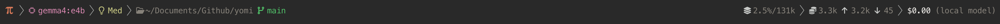
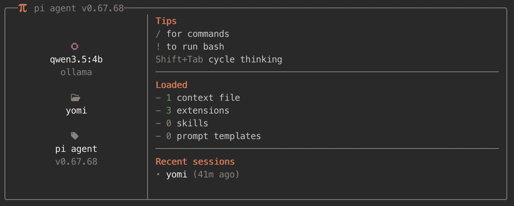

# Custom pi.dev setup

My opinionated configuration for [pi.dev](https://pi.dev/), a minimal terminal coding agent. This repo tweaks the TUI experience with a custom startup screen, footer status bar, dynamic spinner verbs, and a warm color theme — all namespaced under the `slop-*` prefix.

## What's in here

```
agent/
├── configs/
│   ├── slop-footer.json   # Footer segment configuration (tracked)
│   └── slop-mcp.json      # MCP server config — gitignored, see slop-mcp/slop-mcp.json.example
├── themes/
│   └── slop.json          # Custom warm color theme
└── extensions/
    ├── slop-footer/       # Status bar with git, tokens, cost, context
    ├── slop-mcp/          # MCP server bridge with lazy connections and proxy tool
    ├── slop-spinners/     # Rotating spinner verbs while the agent thinks
    └── slop-startup/      # Welcome header shown at session start
```

### slop-footer

A customizable footer that replaces pi's default status bar. Renders live data in left- and right-aligned segments:

- **Left**: agent icon, separator, active model, thinking level, current path, git branch + dirty state
- **Right**: context window %, total/input/output token counts, estimated API cost

Segments are configured via `slop-footer.json`. Supports Nerd Font icons with plain-ASCII fallbacks. Git status is cached and invalidated automatically on file writes or git operations.



### slop-spinners

Replaces the default "Thinking..." working message with ~180 rotating verbs. A new verb is picked every 2.5 seconds with a typewriter reveal effect (42ms per character). Hooks into `turn_start` / `message_update` / `turn_end` to start, stop, and clean up timers.

Sample verbs: Architecting, Boondoggling, Flibbertigibbeting, Hyperspacing, Lollygagging, Perambulating...

### slop-mcp

Bridges [Model Context Protocol (MCP)](https://modelcontextprotocol.io) servers into pi with minimal context overhead. Instead of registering every MCP tool individually at startup (which can burn thousands of tokens), it registers a single `mcp` proxy tool. The LLM searches for tools with `mcp({ search: "keyword" })`, inspects schemas with `mcp({ describe: "tool_name" })`, and calls them with `mcp({ tool: "tool_name", args: '{...}' })`. Servers start lazily — only when a tool is actually invoked. Tool metadata is cached to disk so discovery works without live connections.

Key features: lazy server startup, proxy tool pattern, disk metadata cache, proper session restart lifecycle, per-server `directTools` opt-in, config merging across all standard MCP locations, `${VAR}` env interpolation, and connected-server count in the footer status bar. Use `/mcp` for status, `/mcp tools [server]` to list tools, `/mcp reconnect [server]`, `/mcp search <query>`.

### slop-startup

Renders a two-column welcome box at session start showing: active model + provider, current working directory, keyboard shortcut hints, counts of loaded context files / extensions / skills / prompt templates / MCP servers, and up to three recent sessions with relative timestamps. Hidden below 44 terminal columns.



### slop theme

A warm, earthy color palette (`themes/slop.json`). Primary: `#d67858` (terracotta). Text: `#f5f2ee` (warm white). Covers all 51 required pi color tokens including syntax highlighting and thinking level indicators.

---

## First-run setup

`agent/settings.json` and `agent/models.json` are both excluded from this repo — they contain personal API keys, local model definitions, and preferences that vary per machine.

When you clone and run `pi` for the first time, everything defaults to pi's built-in defaults, which means:
- The **slop theme won't be active**
- Any **local Ollama models** you use won't be registered

**Activate the slop theme** — create `~/.pi/agent/settings.json` (or add to it if it exists):

```json
{
  "theme": "slop"
}
```

**Register local models** — create `~/.pi/agent/models.json`. Example for Ollama:

```json
{
  "providers": {
    "ollama": {
      "api": "openai-completions",
      "apiKey": "ollama",
      "baseUrl": "http://127.0.0.1:11434/v1",
      "models": [
        {
          "id": "your-model-name",
          "contextWindow": 131072,
          "input": ["text", "image"],
          "reasoning": true
        }
      ]
    }
  }
}
```

See the [Model Configuration](#model-configuration) section below for all supported providers and options.

---

## About pi.dev

[Pi](https://pi.dev/) is a minimal, extensible terminal coding agent. Its philosophy is a small core with maximal extensibility — features like plan mode, permission gates, MCP, and sub-agents are left to the community to build via extensions and packages.

Below is a high-level map of what you can extend or configure.

### Extensions

TypeScript modules that hook into pi's lifecycle. Auto-discovered from `~/.pi/agent/extensions/` (global) or `.pi/extensions/` (project-local). Hot-reloadable via `/reload`.

An extension exports a default function that receives `ExtensionAPI`:

```ts
export default function myExtension(pi: ExtensionAPI) {
  pi.on("session_start", async (_event, ctx) => {
    ctx.ui.notify("Hello from my extension!", "info");
  });
}
```

**What extensions can do:**

| Capability | API |
|---|---|
| React to lifecycle events | `pi.on("session_start" \| "turn_start" \| "turn_end" \| "message_update" \| "tool_result" \| "user_bash" \| ...)` |
| Register LLM-callable tools | `pi.registerTool()` |
| Register slash commands | `pi.registerCommand("/mycommand", { handler })` |
| Intercept / block tool calls | Event hooks with `ctx.intercept()` |
| Inject context into the session | `ctx.injectContext()` |
| Customize conversation compaction | Override the compaction handler |
| Persist state across restarts | `pi.appendEntry()` |
| Prompt the user | `ctx.ui.select()`, `ctx.ui.confirm()`, `ctx.ui.input()`, `ctx.ui.notify()` |
| Custom TUI components | `ctx.ui.custom(component)` — full keyboard input, overlays |
| Status line items | `ctx.ui.setStatus("key", styledText)` |
| Widgets above/below editor | `ctx.ui.setWidget("key", lines)` |
| Replace the footer | `ctx.ui.setFooter(component)` |
| Replace the header | `ctx.ui.setHeader(component)` |
| Custom editor (e.g., vim mode) | `ctx.ui.setEditorComponent(factory)` |
| Set working message | `ctx.ui.setWorkingMessage("Thinking...")` |

Built-in TUI building blocks (`@mariozechner/pi-tui`): `Text`, `Box`, `Container`, `Spacer`, `Markdown`, `SelectList`, `SettingsList`, `BorderedLoader`, and more.

Extension examples from the pi repo: permission gates, git checkpointing, path protection, conversation summarizers, interactive tools, a todo-list tool, even a Snake game.

**Security note:** extensions run with full system access. Only install from sources you trust.

### Skills

Self-contained capability packages loaded on-demand from the filesystem. Each skill is a directory with a `SKILL.md` file:

```
my-skill/
├── SKILL.md       # frontmatter (name, description) + instructions
├── scripts/
│   └── run.sh
└── references/
    └── api.md
```

Pi implements the [Agent Skills standard](https://agentskills.io/specification). At startup, pi reads all skill names and descriptions into the system prompt. When a task matches, the agent reads the full `SKILL.md` on-demand (progressive disclosure). Skills can also be invoked explicitly with `/skill:name`.

Skill locations: `~/.pi/agent/skills/`, `.pi/skills/`, `.agents/skills/`, or listed in `settings.json`.

### MCP (Model Context Protocol)

Pi has **no built-in MCP support** — this is a deliberate design choice. The `slop-mcp` extension in this repo provides a full MCP bridge. See `agent/extensions/slop-mcp/README.md` for configuration details.

The two general approaches for adding external tools to pi:

1. **Skills** — wrap any external tool in a `SKILL.md`. The agent reads the instructions and invokes it via shell commands. No protocol needed; a well-documented script is enough.
2. **Extensions** — register tools directly via `pi.registerTool()`. The key thing to understand is how the LLM learns about a tool: every registered tool's `name`, `description`, and parameter schema are injected into the system prompt automatically. The LLM picks the right tool by reading those descriptions — exactly like any built-in tool.

### Prompt Templates

Markdown files that expand into prompts via `/name`. Filename becomes the command. Supports positional arguments (`$1`, `$2`, `$@`).

```markdown
---
description: Review staged git changes
argument-hint: "[focus area]"
---
Review `git diff --cached`. Focus on: $@
```

Saved to `~/.pi/agent/prompts/` (global) or `.pi/prompts/` (project). Invoked with `/review` or `/review security`.

### Themes

JSON files with exactly 51 color tokens covering: core UI, backgrounds, markdown rendering, syntax highlighting, thinking level indicators, and diff colors. Placed in `~/.pi/agent/themes/` and activated via `"theme": "name"` in `settings.json`. Hot-reloaded when the file changes.

### Packages

Bundle extensions, skills, prompt templates, and themes for sharing. Distributed via npm or git:

```bash
pi install npm:@foo/my-pi-package
pi install git:github.com/user/repo
pi install ./local/path
```

Declare resources in `package.json` under the `"pi"` key, or use conventional directories (`extensions/`, `skills/`, `prompts/`, `themes/`). Tag with `pi-package` keyword for gallery discoverability.

### Model Configuration

Defined in `~/.pi/agent/models.json`. Supports 15+ providers: Anthropic, OpenAI, Google, Ollama, LM Studio, vLLM, Azure, and more. Models can be configured with custom context windows, token limits, reasoning support, and OpenAI-compatible API endpoints for local inference. Hot-reloaded when the file changes.

### Keybindings

Configured in `~/.pi/agent/keybindings.json`. Supports modifiers (`ctrl`, `shift`, `alt`), chord bindings, and remapping of any core action.

### Settings

Global: `~/.pi/agent/settings.json`. Project: `.pi/settings.json`. Nested objects merge rather than replace, so project settings layer on top of global ones. Covers model defaults, thinking level, UI preferences, session behavior, and resource toggles.